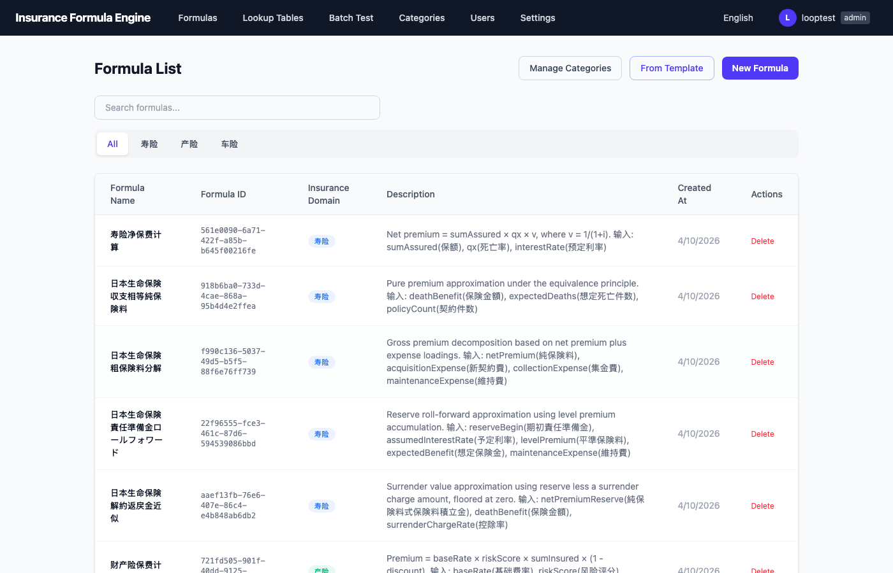
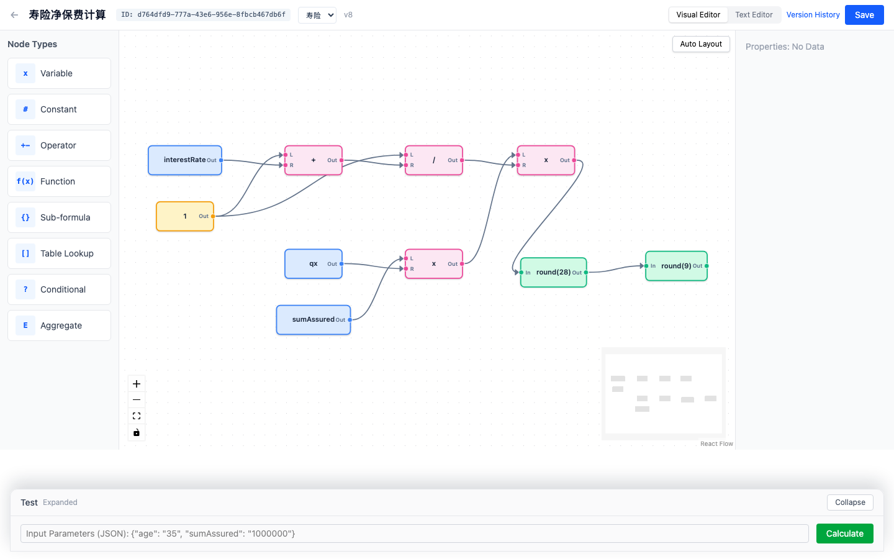
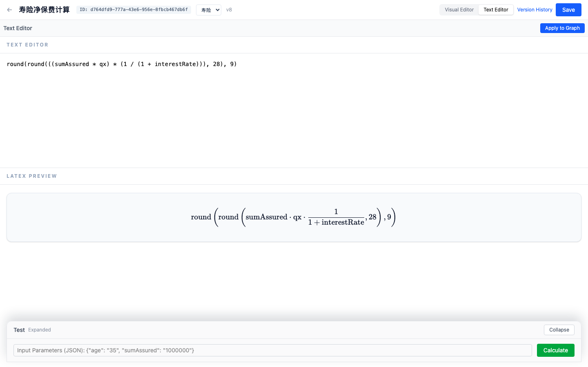
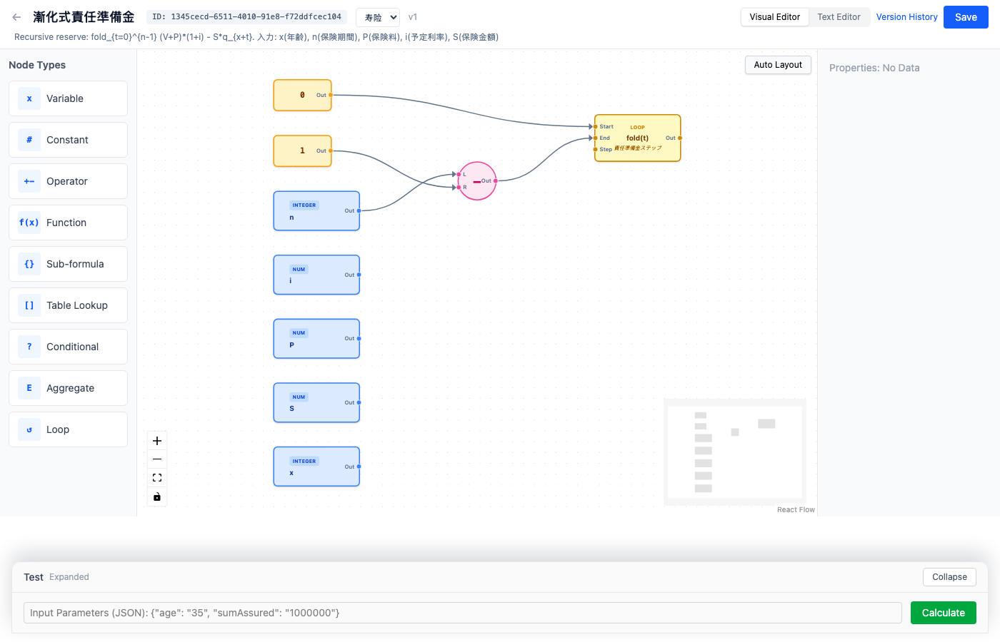
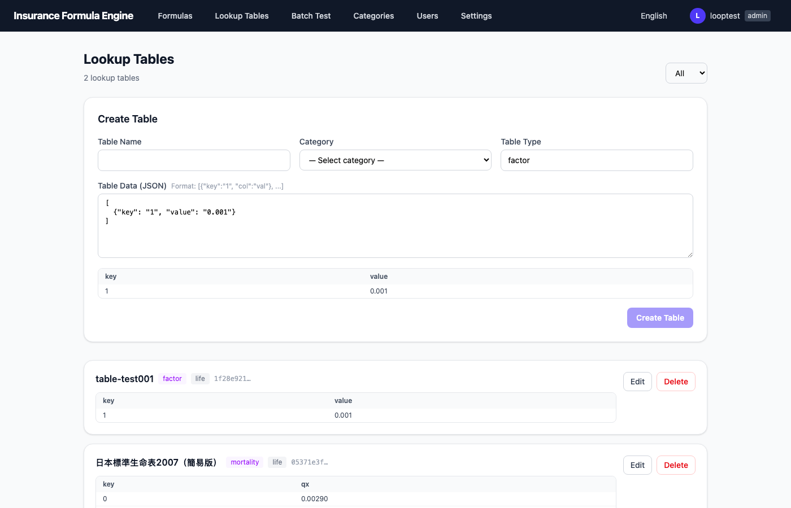
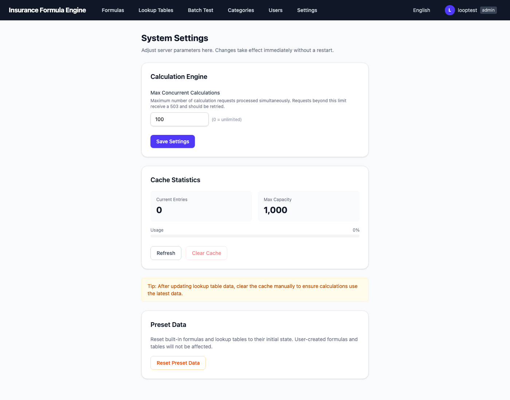
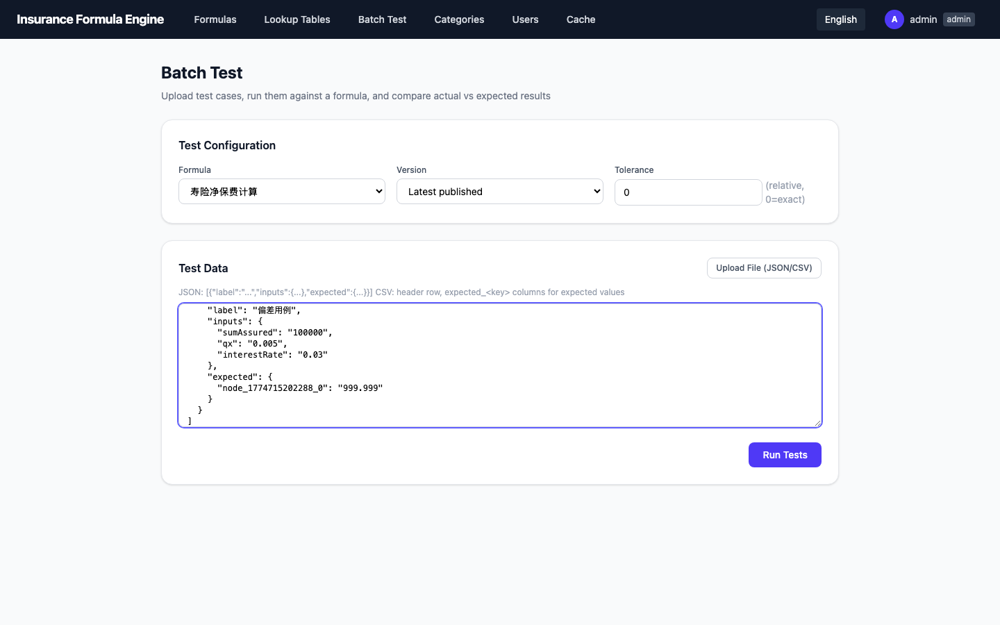
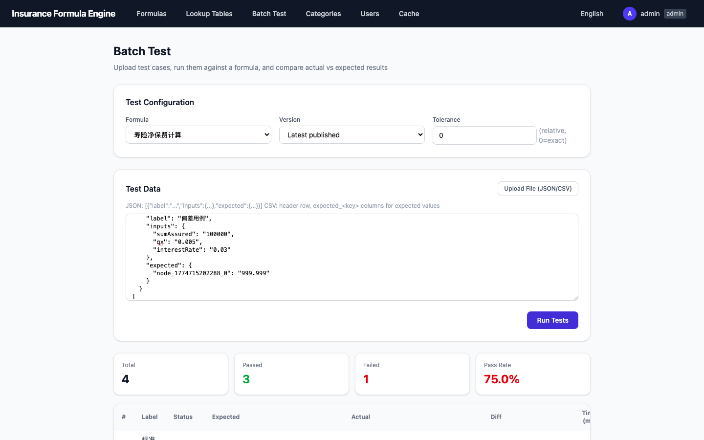
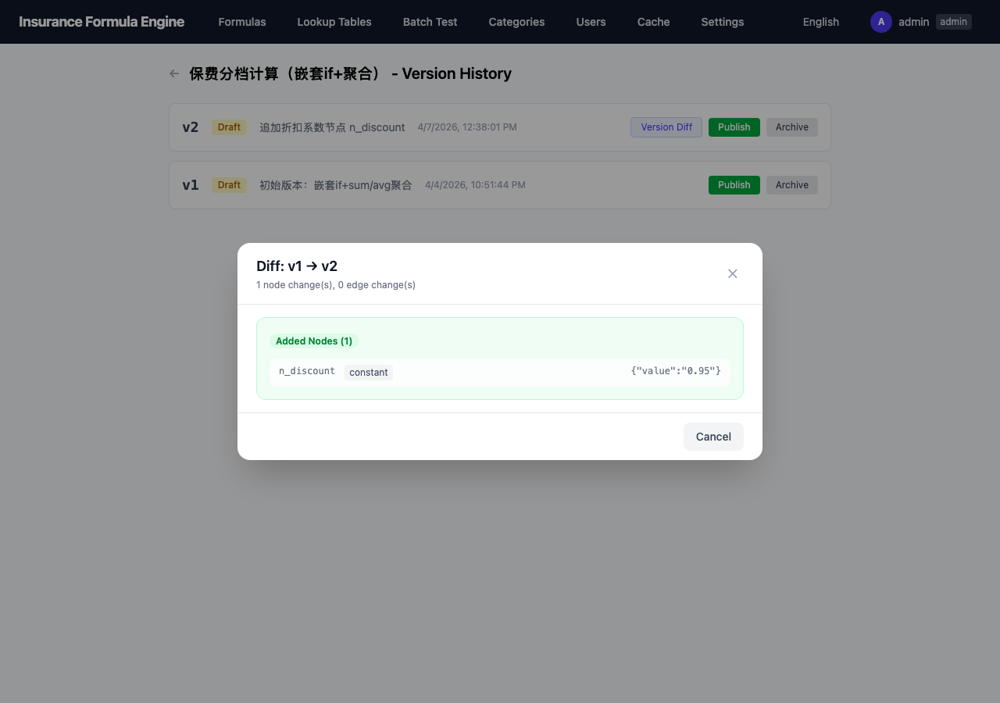

# Insurance Formula Service

A visual formula calculation engine for the insurance industry, supporting life insurance (including actuarial loop calculations), property insurance, and auto insurance domains.

## Screenshots

### Formula List


### Visual Formula Editor (with Loop node)


### Text Formula Editor + LaTeX Preview


### Loop Fold Mode (Reserve Recursion)


### Lookup Tables


### Admin Settings (with Preset Data Reset)


### Batch Test — Input


### Batch Test — Results


### Version Diff


## Features

### Formula Editor
- **Visual Editor** — Drag-and-drop DAG editor powered by React Flow with auto layout
- **10 Node Types** — variable, constant, operator, function, subFormula, tableLookup, **tableAggregate**, conditional, aggregate, **loop**
- **Dual-Mode Editing** — Switch between visual canvas and text expression mode with bidirectional conversion
- **LaTeX Preview** — Real-time mathematical notation rendering (KaTeX)
- **LaTeX Input** — Type LaTeX directly, auto-converts to formula text
- **Node Description** — Optional documentation field per node, displayed as hover tooltip
- **Graph Validation** — Cycle detection, port completeness, identifier rules

### Loop Node (Actuarial)
- **8 Aggregation Modes** — sum, product, count, avg, min, max, last, **fold**
- **Sum/Product/etc.** — Map-reduce style: each iteration is independent
- **Fold Mode** — Stateful accumulation: each step receives the previous result
  - Required for recursive formulas like reserve recursion `V[t+1] = (V[t]+P)(1+i) - S·q_{x+t}`
- **Empty Iteration Identity** — `sum→0`, `product→1`, `count→0` (mathematical identity elements)
- **Nested Loops** — Inner loop receives outer iterator via seedInputs
- **Text Format** — `sum_loop("body-id", t, 1, n)`, `fold_loop("body-id", t, 0, n, V, 0)`
- **LaTeX Rendering** — `\sum_{t=1}^{n}`, `\prod_{t=1}^{n}`, `\operatorname{fold}_{t=0}^{n}`

### Calculation Engine
- **High-Precision Decimal** — 18-28 decimal places via shopspring/decimal
- **Parallel Execution** — DAG-based parallelization of independent branches
- **Concurrency Control** — Configurable max concurrent calculations (admin settings).
  Batch Test runs cases in parallel with `floor(maxConcurrentCalcs / 5)` workers
  (minimum 1), so at least 4/5 of the global calculation budget remains available
  for interactive single-calculation requests. When `maxConcurrentCalcs` is `0`
  (unlimited), Batch Test uses 8 workers. Each per-case calculation still acquires
  a slot from the shared limiter, so the configured global cap is never exceeded
  regardless of how many batch workers exist.
- **Result Cache** — LRU cache with admin clear function
- **Sub-formula References** — Compose formulas from other formulas (with recursion guard)

### Data Management
- **Lookup Tables** — Mortality tables, rate tables (multi-key composite lookup supported)
- **Formula Versions** — Draft → Published → Archived state machine
- **Version Diff** — Visual comparison between formula versions
- **Formula Templates** — Pre-built insurance formula gallery
- **Preset Data Reset** — One-click reset of seed formulas/tables (admin only, preserves user data)
- **Formula Deletion** — Admin-only delete with confirmation dialog

### Testing
- **Single Calculation** — Inline test panel in the editor
- **Batch Test** — Upload JSON/CSV test cases, compare against expected values with tolerance
- **Multi-Database** — SQLite (embedded), PostgreSQL, MySQL

### Auth & i18n
- **JWT-based Auth** — Login, register, role-based access control
- **RBAC** — Admin, Editor, Reviewer, Viewer roles
- **i18n** — Chinese, Japanese, English

## Tech Stack

| Layer | Technology |
|-------|-----------|
| Frontend | React 19, TypeScript, Tailwind CSS 4, @xyflow/react 12, KaTeX |
| State | Zustand, TanStack Query |
| Backend | Go 1.26, chi router |
| Precision | shopspring/decimal |
| Database | SQLite (modernc.org/sqlite), PostgreSQL (pgx), MySQL |
| Auth | golang-jwt, bcrypt |

## Quick Start

### Development

```bash
# Install frontend dependencies
make frontend-install

# Start backend + frontend dev servers
make dev
```

Backend runs on `http://localhost:8080`, frontend on `http://localhost:5173` with API proxy.

### Docker

```bash
docker compose up -d
```

Backend on port 8080, frontend on port 3000.

### Build

```bash
make build
```

## Default Account & Seed Data

On first startup, the system automatically creates:

### Default Admin Account

| Field | Value |
|-------|-------|
| Username | `admin` |
| Password | `admin99999` |
| Role | Admin |

### Seed Formulas

The system includes pre-built formulas across three domains:

#### Basic Formulas (no loop)
1. **Life Insurance — Net Premium** (`寿险净保费计算`): `premium = sumAssured × qx × v`
2. **Life Insurance — Equivalence Premium** (`日本生命保険 収支相等純保険料`)
3. **Life Insurance — Gross Premium Decomposition** (`日本生命保険 粗保険料分解`)
4. **Life Insurance — Reserve Roll-Forward** (`日本生命保険 責任準備金ロールフォワード`)
5. **Life Insurance — Surrender Value Approximation** (`日本生命保険 解約返戻金近似`)
6. **Property Insurance — Premium Rating** (`财产险保费计算`)
7. **Auto Insurance — Commercial Premium** (`车险商业保费计算`)

#### Actuarial Loop Formulas
Built on the Loop node with the Japanese Standard Life Table 2007 (simplified):

- **Body sub-formulas**: `生存率因子 1-qx`, `死亡給付PV項`, `年金現価項`, `責任準備金ステップ`
- **Main formulas**:
  - **Pure Premium (lump sum)** `定期保険一時払純保険料` — `S × Σ_{t=1}^{n} v^t · _{t-1}p_x · q_{x+t-1}` (nested sum + product loops)
  - **Annuity Present Value** `期始払年金現価` — `Σ_{t=0}^{n-1} v^t · _tp_x` (nested sum + product loops)
  - **Reserve Recursion** `漸化式責任準備金` — `V[t+1] = (V[t]+P)(1+i) - S·q_{x+t}` (fold mode)

### Seed Tables

- **Japanese Standard Life Table 2007 (Simplified)** — Mortality rates `qx` for ages 0-100

### Calculation API Example

```bash
# Login
TOKEN=$(curl -s http://localhost:8080/api/v1/auth/login \
  -H 'Content-Type: application/json' \
  -d '{"username":"admin","password":"admin99999"}' | jq -r .token)

# Calculate pure premium with the actuarial loop formula
curl -s -X POST http://localhost:8080/api/v1/calculate \
  -H "Authorization: Bearer $TOKEN" \
  -H 'Content-Type: application/json' \
  -d '{
    "formulaId": "<pure-premium-formula-id>",
    "inputs": {
      "S": "1000000",
      "x": "30",
      "n": "10",
      "v": "0.97087378640776"
    }
  }'
```

## API

All endpoints under `/api/v1/`:

| Method | Path | Description | Permission |
|--------|------|-------------|-----------|
| POST | `/auth/login` | Login | Public |
| POST | `/auth/register` | Register | Public |
| POST | `/parse` | Parse formula text → graph | Public |
| GET | `/templates` | List formula templates | Public |
| GET | `/auth/me` | Current user info | Auth |
| GET | `/formulas` | List formulas (filter, search, paginate) | Auth |
| POST | `/formulas` | Create formula | Editor+ |
| GET | `/formulas/:id` | Get formula | Auth |
| PUT | `/formulas/:id` | Update formula | Editor+ |
| DELETE | `/formulas/:id` | Delete formula | **Admin only** |
| GET | `/formulas/:id/versions` | List versions | Auth |
| POST | `/formulas/:id/versions` | Create version | Editor+ |
| PATCH | `/formulas/:id/versions/:ver` | Update version state | Reviewer+ |
| GET | `/formulas/:id/diff` | Version diff | Auth |
| POST | `/calculate` | Execute calculation | Auth |
| POST | `/calculate/batch` | Batch calculation | Auth |
| POST | `/calculate/batch-test` | Batch test with expected values | Auth |
| POST | `/calculate/validate` | Validate formula graph | Auth |
| GET | `/tables` | List lookup tables | Auth |
| POST | `/tables` | Create lookup table | Editor+ |
| GET | `/tables/:id` | Get lookup table | Auth |
| PUT | `/tables/:id` | Update lookup table | Editor+ |
| DELETE | `/tables/:id` | Delete lookup table | Editor+ |
| GET | `/categories` | List categories | Auth |
| POST | `/categories` | Create category | Admin |
| GET | `/users` | List users | Admin |
| GET | `/cache` | Cache stats | Admin |
| DELETE | `/cache` | Clear cache | Admin |
| GET | `/settings` | Get system settings | Admin |
| PUT | `/settings` | Update system settings | Admin |
| POST | `/admin/reset-seed` | Reset preset formulas/tables | Admin |

## RBAC Roles

| Permission | Admin | Editor | Reviewer | Viewer |
|-----------|-------|--------|----------|--------|
| View Formulas | Y | Y | Y | Y |
| Calculate | Y | Y | Y | Y |
| Create/Edit Formula | Y | Y | - | - |
| **Delete Formula** | **Y** | **-** | - | - |
| Publish/Archive Version | Y | - | Y | - |
| Manage Tables | Y | Y | - | - |
| Manage Users | Y | - | - | - |
| Manage Categories | Y | - | - | - |
| Reset Preset Data | Y | - | - | - |

## Formula Model

Formulas are stored as JSON DAGs:

```json
{
  "nodes": [
    {"id": "n1", "type": "variable", "config": {"name": "age", "dataType": "integer"}, "description": "Age in years"},
    {"id": "n2", "type": "operator", "config": {"op": "multiply"}},
    {"id": "n3", "type": "function", "config": {"fn": "round", "args": {"places": "18"}}}
  ],
  "edges": [
    {"source": "n1", "target": "n2", "sourcePort": "out", "targetPort": "left"},
    {"source": "n2", "target": "n3", "sourcePort": "out", "targetPort": "in"}
  ],
  "outputs": ["n3"],
  "layout": {
    "positions": {"n1": {"x": 50, "y": 50}, "n2": {"x": 250, "y": 50}, "n3": {"x": 450, "y": 50}}
  }
}
```

### Node Types

| Type | Description | Config Fields |
|------|-------------|--------------|
| `variable` | Input variable | `name`, `dataType` |
| `constant` | Fixed value | `value` |
| `operator` | Arithmetic op | `op` (add/subtract/multiply/divide/power/modulo) |
| `function` | Math function | `fn` (round/floor/ceil/abs/min/max/sqrt/ln/exp), `args` |
| `subFormula` | Sub-formula ref | `formulaId`, `version` |
| `tableLookup` | Single-key table lookup | `tableId`, `keyColumns`, `column` |
| `tableAggregate` | SQL-style aggregate over a table (since task #040) | `tableId`, `aggregate` (sum/avg/count/min/max/product), `expression` (column name), `filters` (array of `{column, op, value\|inputPort, negate}`), `filterCombinator` (`and`/`or`) |
| `conditional` | If/else branch | Legacy: `comparator` (eq/ne/gt/ge/lt/le). Composite (since task #039): `conditions` (array of `{op, negate}`) + `combinator` (`and`/`or`) for multi-term AND/OR/NOT — see Known Limitations |
| `aggregate` | Aggregation | `fn` (sum/product/count/avg), `range` |
| `loop` | Iteration | `mode`, `formulaId`, `iterator`, `aggregation`, `accumulatorVar` (fold), `initValue` (fold), `inclusiveEnd`, `maxIterations` |

### Loop Node Text Syntax

```
sum_loop("body-formula-id", t, 1, n)              # Σ
product_loop("body-formula-id", t, 1, n)          # Π
avg_loop("body-formula-id", t, 1, n)              # average
fold_loop("body-formula-id", t, 0, n, V, 0)       # recursive fold with accumulator V, init 0
```

## User Guide

A step-by-step user guide for non-technical users is available in three languages:

- [Chinese (中文)](docs/guide/formula-editor-guide-zh.md)
- [English](docs/guide/formula-editor-guide-en.md)
- [Japanese (日本語)](docs/guide/formula-editor-guide-ja.md)

## Known Limitations

A few engine features have intentional gaps. Each is tracked as a future
research item in [`docs/backlog.md`](docs/backlog.md).

### Loop Node — Visual Editor Only

Loop nodes (`sum_loop` / `product_loop` / `fold_loop` / etc.) cannot be
edited in the **Text Editor** mode. Switching a formula that contains a
loop node to text mode shows an inline notice
(i18n key `editor.loopNoTextMode`). Use the **Visual Editor** for any
formula that contains a loop. The text-mode lexer/parser would need a
loop-comprehension syntax extension to round-trip these graphs.

### Composite Conditional (AND / OR / NOT) — Visual Editor Only

Since task #039, a `conditional` node can carry multiple condition terms
joined by `and` / `or` / `not` (see the spec
[`003-conditional-logical-operators.md`](docs/specs/003-conditional-logical-operators.md)).
This unblocks IBNR-style release rules and any other multi-term predicate.

Limitations of the current implementation:

1. **Text editor mode is not supported** for composite conditionals. The
   text grammar has no `and` / `or` / `not` keywords yet, so DAGToAST
   short-circuits with an explicit error directing the user to the
   visual editor (same UX pattern as the loop limitation above). Adding
   a boolean-aware text grammar is a future task.
2. **Mixing AND and OR inside one node is not supported.** A single
   `conditional` node uses one uniform `combinator` across all its
   terms. To express `A AND (B OR C)`, nest two `conditional` nodes.
3. **Visual editor UI for adding terms is not yet built.** Composite
   conditionals are currently authorable through the API or
   hand-written JSON. A panel UI for "add condition / change
   combinator" is a follow-up frontend task.

### Lookup Table Aggregation — Supported via `tableAggregate`

Since task #040 (spec 004) the engine has a dedicated `tableAggregate`
node that does SQL-style `SELECT <aggregate>(<column>) FROM <table>
WHERE <filters>`. It supports `sum / avg / count / min / max / product`,
multi-filter `AND / OR / NOT`, and dynamic filter values pulled from
other nodes — sufficient to express the chain ladder LDF in a single
node. v1 only allows a single column name in `expression` (no DSL or
self-join); see the spec
[`docs/specs/004-table-aggregate-node.md`](docs/specs/004-table-aggregate-node.md)
for the v2 roadmap (column expressions, group-by, self-join).

### No Built-in Statistical Distribution Functions

Functions like `normal_cdf` / `normal_quantile` / `chi²` are not in the
built-in math function set. For credibility-theory formulas that need
the standard normal quantile (e.g., `k = 1.96` for a 95% confidence
band), pass the constant in as an input variable or hardcode it as a
`constant` node.

### No Date / Time Arithmetic

The engine has no `date` type and no day-count / month-fraction helpers.
Time-based factors (the 1/24 unearned premium rule, short-term refund
rates, day-count conventions) must be modeled as pre-computed lookup
tables indexed by month or as closed-form arithmetic.

### Engine State Is Per-Calculate-Call Only

Each `Calculate` invocation is stateless. Reserves and other formulas
that need historical state must receive that state through inputs; the
client must orchestrate the carry-over.

## Project Structure

```
formula-service/
├── backend/
│   ├── cmd/server/         # Entry point + seed data + reset handler
│   └── internal/
│       ├── api/            # HTTP handlers + router
│       ├── auth/           # JWT + RBAC
│       ├── config/         # Configuration
│       ├── domain/         # Domain models
│       ├── engine/         # Calculation engine (DAG, parallel, evaluator, loop, fold)
│       ├── parser/         # Pratt parser (text ↔ AST ↔ DAG)
│       └── store/          # Repository layer (sqlite, postgres, mysql)
├── frontend/
│   └── src/
│       ├── api/            # API client
│       ├── components/
│       │   ├── editor/     # Visual + text formula editor
│       │   ├── shared/     # Lists, settings, batch test
│       │   ├── version/    # Version management + diff
│       │   └── auth/       # Login / register
│       ├── i18n/locales/   # zh / ja / en
│       ├── store/          # Zustand stores
│       ├── types/          # TypeScript types
│       └── utils/          # graphSerializer, graphText, formulaLatex, latexToFormula
├── docs/
│   ├── backlog.md          # Requirement pool
│   ├── tasks/              # Per-feature task files
│   ├── guide/              # User guide (zh/en/ja) + screenshots
│   └── screenshots/        # README screenshots
├── tests/
│   ├── batch/              # Reusable batch test data
│   ├── reports/            # Test reports (Markdown)
│   └── screenshots/        # Visual verification screenshots
├── prompt_history/         # Archived user prompts (per day)
├── Makefile
└── docker-compose.yml
```

## Development Workflow

This project uses a three-layer task management system to keep long-running development resilient to interruptions.

### Three Layers

| Layer | File | Purpose |
|-------|------|---------|
| Requirement pool | `docs/backlog.md` | Collect all requirements, prioritize |
| Task files | `docs/tasks/NNN-slug.md` | Full lifecycle of one feature (need, design, TODO, interruption notes) |
| Workflow rules | `CLAUDE.md` | Auto-followed dev rules every session |

### Workflow

```
New requirement → Add to backlog.md
    ↓
Start work     → Create task file from TEMPLATE.md
    ↓
Implement     → Mark TODO ✓ each step, codex review, commit
    ↓
Interrupted?  → Update task TODO progress + write 中断记录
    ↓
Resume        → Read backlog → find in-progress task → continue
    ↓
Done          → Status: done, move to backlog 已完成
```

### Testing Convention

```
tests/
├── batch/{task-number}/      # Batch test JSON data (reusable)
├── reports/                  # Markdown test reports
└── screenshots/{task-number}/ # Visual verification screenshots
```

Test data files double as regression tests.

### Prompt History

All user prompts are archived under `prompt_history/YYYY-MM-DD.md` for traceability.

## License

Private
