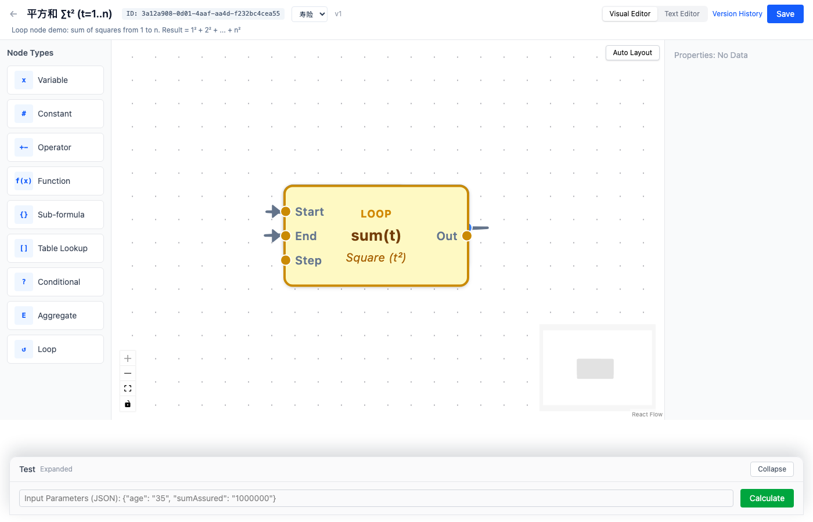
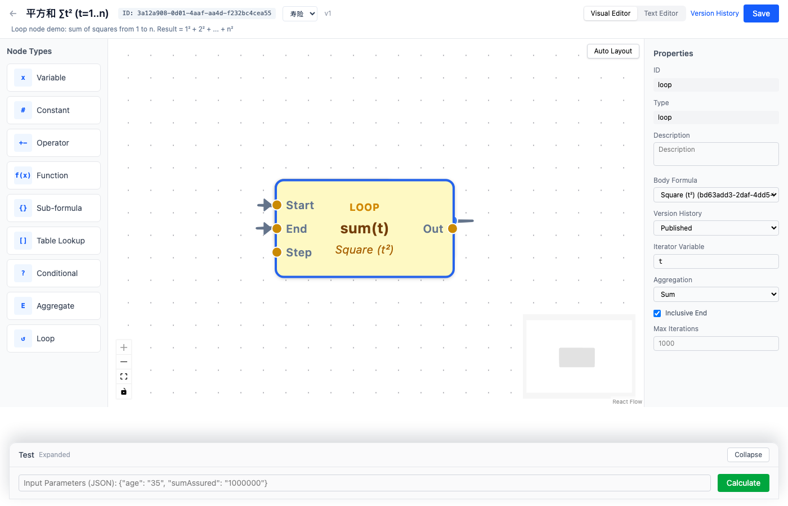
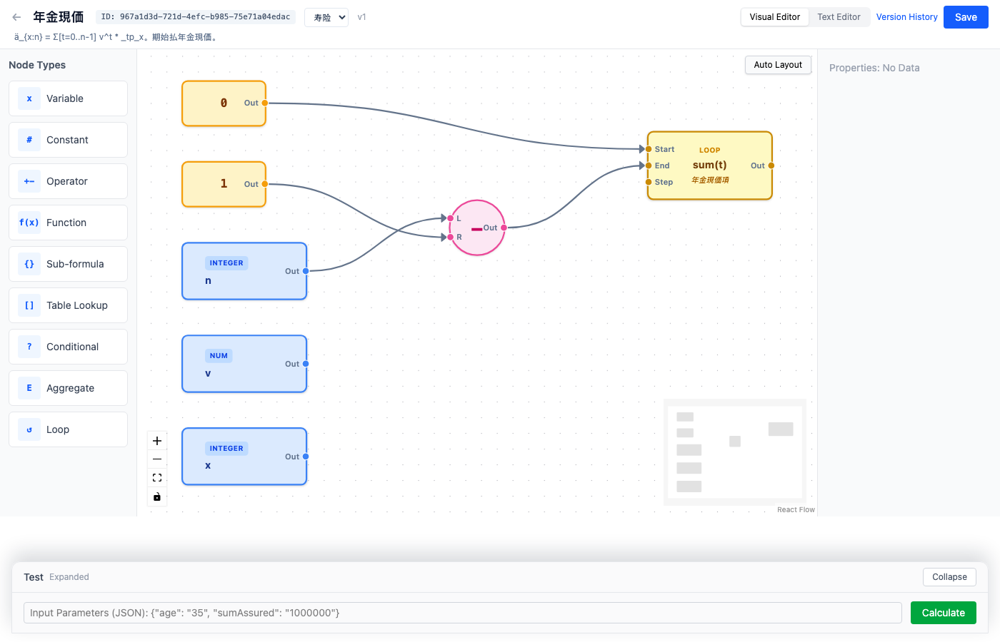
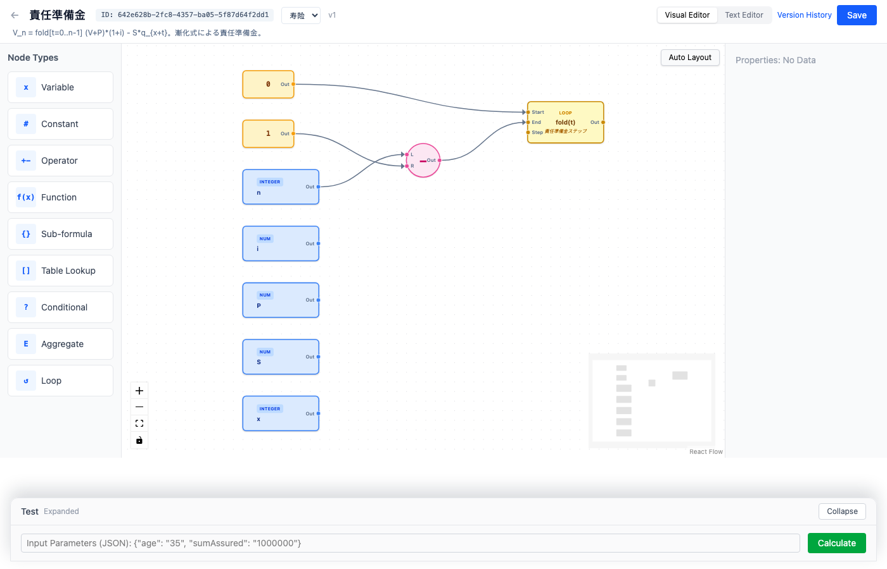
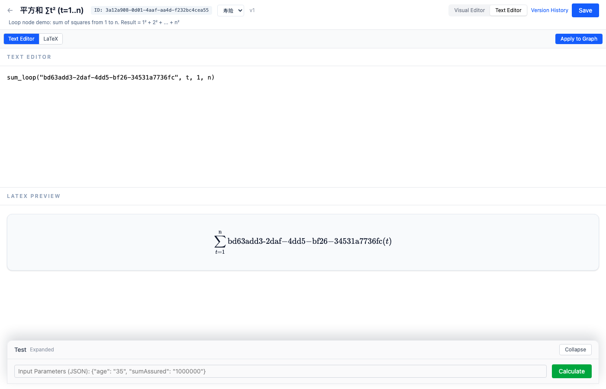

# 計算式エディタ 操作ガイド

本ガイドは、保険計算式エンジンのビジュアルエディタの使い方を、技術者でない方にも分かるように解説したものです。プログラミングの知識は必要ありません。

---

## 1. 画面の見方

計算式エディタを開くと、以下のような画面が表示されます。



| エリア | 位置 | 説明 |
|--------|------|------|
| **ヘッダー** | 画面上部 | 計算式名、分類選択、バージョン番号、モード切替（Visual / Text）、保存ボタン |
| **ノードパレット** | 左サイドバー | ドラッグして使えるノードの一覧 |
| **キャンバス** | 中央 | 計算式を組み立てる作業エリア |
| **プロパティパネル** | 右サイドバー | 選択中のノードの設定を表示・編集 |
| **テストパネル** | 画面下部 | テスト用の入力値を設定し、計算を実行 |

---

## 2. ノードの種類

計算式は「ノード」と呼ばれる部品を組み合わせて作ります。各ノードにはそれぞれの役割があります。

| アイコン | 名称 | 用途 | 例 |
|----------|------|------|-----|
| `x` | **変数** | 計算式への入力値 | 年齢、保険金額、料率 |
| `#` | **定数** | 固定の数値 | 1、100、3.14 |
| `+-` | **演算子** | 四則演算など | 保険金額 × 料率 |
| `f(x)` | **関数** | 数学関数 | round（四捨五入）、sqrt（平方根） |
| `{}` | **サブ計算式** | 別の計算式を参照 | 「基本料率計算」を参照 |
| `[]` | **テーブル参照** | データテーブルから値を検索 | 年齢から死亡率を取得 |
| `?` | **条件** | 条件によって値を切り替え | 年齢 ≥ 65 なら…そうでなければ… |
| `Σ` | **集約** | 複数の値を1つにまとめる | 合計、平均 |
| `↺` | **ループ** | 範囲を指定して繰り返し計算 | t = 1 から n まで合計 |

---

## 3. 基本操作

### 3.1 ノードの作成

1. 左の**ノードパレット**から使いたいノードを見つけます
2. マウスで**ドラッグ**してキャンバス上に配置します
3. マウスボタンを離すと、ノードが作成されます

### 3.2 ノードの接続

ノード同士は**ポート**を通じて接続し、計算の流れを作ります。

- 各ノードの**右側**に出力ポート（Out）があります
- 各ノードの**左側**に1つ以上の入力ポート（Left、Rightなど）があります
- 出力ポートから入力ポートへ**ドラッグ**すると、線でつながります

**接続のルール：**
- データは左から右へ流れます（入力 → 処理 → 出力）
- ノードを自分自身につなぐことはできません
- 各入力ポートに接続できるのは1本だけです

### 3.3 ノードのプロパティ編集

1. キャンバス上のノードを**クリック**して選択します
2. 右側の**プロパティパネル**に設定項目が表示されます
3. ノードの種類に応じて設定を変更します



**ノード別の設定項目：**

| ノード | 設定項目 |
|--------|---------|
| 変数 | 変数名（例：`age`）、データ型 |
| 定数 | 値（例：`100`） |
| 演算子 | 演算の種類：加算(+)、減算(-)、乗算(×)、除算(÷)、べき乗(^)、剰余(%) |
| 関数 | 関数名：round、floor、ceil、abs、min、max、sqrt、ln、exp |
| サブ計算式 | 参照する計算式の選択、バージョン指定（任意） |
| テーブル参照 | テーブルの選択、検索キー列、出力列 |
| 条件 | 比較演算子：==、!=、>、>=、<、<= |
| ループ | ループ本体の計算式、イテレータ変数名、集約方式 |

### 3.4 ノード・接続線の削除

1. 削除したいノードまたは接続線を**クリック**して選択します
2. キーボードの **Delete** キーを押します

### 3.5 自動レイアウト

ノードの配置が乱れた場合は、キャンバス上部の**「自動レイアウト」**ボタンをクリックすると、見やすく整列されます。

---

## 4. 計算式を作ってみよう

### 例：BMI（ボディマス指数）の計算

BMI = 体重 ÷ 身長²

**手順：**

1. **変数**ノードをドラッグし、名前を `weight`（体重）にします
2. もう1つ**変数**ノードをドラッグし、名前を `height`（身長）にします
3. **定数**ノードをドラッグし、値を `2` にします
4. **演算子**ノードをドラッグし、「べき乗(^)」を選びます
   - `height` を Left ポートに接続
   - 定数 `2` を Right ポートに接続
5. もう1つ**演算子**ノードをドラッグし、「除算(÷)」を選びます
   - `weight` を Left ポートに接続
   - べき乗の結果を Right ポートに接続

これで、左から右に流れる計算フローが完成します。

---

## 5. 応用機能

### 5.1 サブ計算式の参照

計算式が複雑になった場合、一部を独立したサブ計算式として分離し、メインの計算式から参照できます。

1. まずサブ計算式を作成・保存・公開します
2. メインの計算式で**サブ計算式**ノードをドラッグします
3. プロパティパネルで参照する計算式を選択します

### 5.2 テーブル参照

あらかじめ登録されたデータテーブル（料率表、死亡率表など）から値を検索できます。

1. **テーブル参照**ノードをドラッグします
2. プロパティパネルでデータテーブルを選択します
3. 検索キーとなる列を設定します
4. 取得したい値の列を設定します
5. 検索キーの値を入力ポートに接続します

### 5.3 条件分岐

条件に応じて異なる計算を行います。

1. **条件**ノードをドラッグします
2. 比較演算子を設定します（例：`>=`）
3. 4つの入力ポートを接続します：
   - **If**：比較される値（例：年齢）
   - **Cmp**：比較の基準値（例：定数 65）
   - **Then**：条件が成立した場合の値
   - **Else**：条件が成立しなかった場合の値

### 5.4 ループ（繰り返し計算）

年度ごとの繰り返し計算に使います。保険数理計算の中核となる機能です。



**基本ループ（合計・積）：**

1. ループ本体となるサブ計算式を作成・公開します
2. メインの計算式で**ループ**ノードをドラッグします
3. プロパティを設定します：
   - **ループ本体計算式**：作成したサブ計算式を選択
   - **イテレータ変数**：ループ内で使うカウンタ名（例：`t`）
   - **集約方式**：sum（合計）、product（積）など
4. Start ポートと End ポートに範囲を接続します

**再帰ループ（Fold）：**

前のステップの結果を使って次のステップを計算する場合に使います（例：責任準備金の再帰式）。



1. ループノードをドラッグし、集約方式を **Fold** にします
2. **累積変数名**（例：`V`）と**初期値**（例：`0`）を設定します
3. ループ本体の計算式で `V`（前ステップの結果）と `t`（現在のステップ）を使用します

---

## 6. テキスト編集モード

ビジュアルエディタのほかに、テキストで計算式を記述するモードもあります。



### 6.1 テキストモードへの切り替え

画面上部の**「Text Editor」**タブをクリックします。

### 6.2 テキスト記法

| 記法 | 意味 |
|------|------|
| `a + b` | 加算 |
| `a * b` | 乗算 |
| `a / b` | 除算 |
| `a ^ 2` | べき乗 |
| `round(x, 2)` | 小数第2位で四捨五入 |
| `sqrt(x)` | 平方根 |
| `if a >= b then x else y` | 条件分岐 |
| `lookup("テーブル名", key)` | テーブル参照 |
| `subFormula("計算式ID")` | サブ計算式の参照 |
| `sum_loop("計算式ID", t, 1, n)` | 合計ループ |
| `product_loop("計算式ID", t, 1, n)` | 積ループ |
| `fold_loop("計算式ID", t, 0, n, V, 0)` | 再帰ループ |

### 6.3 LaTeX プレビュー

テキスト入力欄の下に、数式の**数学的な表記**がリアルタイムで表示されます。

例えば `sum_loop("body", t, 1, n)` と入力すると、以下のように表示されます：

$$\sum_{t=1}^{n} \text{body}(t)$$

### 6.4 LaTeX 入力モード

**「LaTeX」**タブをクリックすると、LaTeX の数式を直接入力できます。入力した数式は自動的に計算式テキストに変換されます。

### 6.5 グラフへの反映

テキストモードで計算式を編集した後、右上の**「Apply to Graph」**ボタンをクリックすると、テキストがビジュアルグラフに変換されます。

### 6.6 テキストモードの制限

一部のノードはまだテキストエディタで往復編集できません。次のノードを含む計算式は**ビジュアルエディタのみで編集**してください：

- **Loop ノード**（`sum_loop` / `product_loop` / `fold_loop` など）：`inclusiveEnd`、`maxIterations`、`version` などの設定はビジュアル編集のみで、テキストモードでは表現できません。制限が発動するとエディタ内に通知が表示されます。
- **複合 Conditional ノード**（複数条件を `AND` / `OR` / `NOT` で結合する形式、task #039 で追加）：テキスト文法に `and` / `or` / `not` キーワードがまだ無いため、複合条件を使う計算式はビジュアルエディタでしか編集できません。テキストモードに切り替えると、明示的なエラーメッセージが表示されてビジュアルへ案内されます。

エンジン全体の既知の制限（統計分布関数、日付計算、テーブル横断集約、呼び出しごとのステートレス性など）は、プロジェクトの [`README.md` § Known Limitations](../../README.md#known-limitations) に記載されています。

---

## 7. テストと計算

### 7.1 テスト用入力値の設定

画面下部の**テストパネル**で、JSON 形式で変数の値を入力します：

```json
{"age": "35", "sumAssured": "1000000"}
```

### 7.2 計算の実行

**「Calculate」**ボタンをクリックすると、入力値を使って計算が実行されます。

### 7.3 結果の確認

計算結果がボタンの横に JSON 形式で表示されます。

---

## 8. 保存とバージョン管理

### 保存

編集が終わったら、右上の**「保存」**ボタンをクリックします。保存前に自動的に検証が行われます：
- **赤い文字**：エラーがあります（接続不足など）
- **緑の「保存しました」**：正常に保存されました

### バージョン履歴

保存するたびに新しいバージョンが作成されます。ヘッダーの**「バージョン履歴」**をクリックすると、過去のすべてのバージョンを確認できます。

---

## よくある質問

**Q: 保存時にエラーが表示されるのはなぜですか？**
すべてのノードの必須入力ポートが接続されているか確認してください。よくある原因：演算子ノードの Left または Right 入力が未接続です。

**Q: ループノードがエラーになるのはなぜですか？**
確認事項：(1) ループ本体の計算式が選択されているか (2) イテレータ変数名が入力されているか (3) Start と End ポートが接続されているか

**Q: テキストモードで余分な出力が表示されるのはなぜですか？**
テキストモードでは、接続先のない変数ノードが独立した出力として表示されます。これは正常な動作です。実際の計算時には、入力パラメータから値が供給されます。
